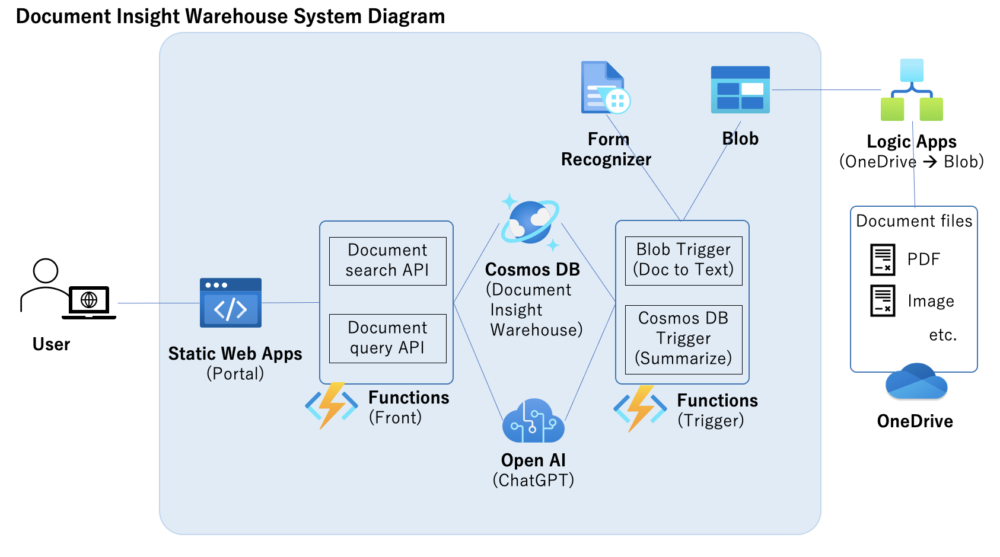

# Azure OpenAI Documents Search App - Document Insight Warehouse

This repo is Document Insight Warehouse project to extract and utilize important documents quickly from a variety of accumulated documents with Azure AI and App services.

## Architecture
* FrontEnd
    * User accesss to portal of a single page app
    * Search docs by keywords with Doc search API
    * Query on docs with Doc query API (utilizing ChatGPT for the query)
* Document Insight Warehouse
    * Doc information is stored in a DB with summary of each doc by ChatGPT
* Triggers
    * Copy docs from OneDrive to blob
    * Extract texts of docs by recognizing forms of the docs (ex. PDF to text)
    * Summarize docs by ChatGPT with pre-defined system message



## Technology stack

* Javascript
* Azure Static Web Apps
* Python
* Azure Functions
* Azure Cosmos DB
* Azure OpenAI
* Auzre Logic Apps
* Azure Blob Storage
* Azure Form Recognizer

## How to use source codes in this repo
You need to set up required Azure services and deploy apps to Functions, Static Web Apps, and Logic Apps.
Here is brief instructions:
1. Clone this repo to your GitHub repo.
2. Update placeholder of \<AzureAD TenandID\> at ```/spa/staticwebapp.config.json``` for AzureAD authentication to a portal app. (If you do not need authentication, just delete the file)
3. Create following services. It can work with default parameters, but please customize based on your requirements.
    * Azure OpenAI
    * Azure Form Recognizer
    * Azure Storage Account (for both docs blob and Functions)
    * Azure Functions x 2 (for frontend and triggers)
    * Azure Static Web Apps (Some parameters required - check GitHub at Deployment source and select the cloned repo, select HTML at build presets and set "/spa" at App location)
    * Azure Cosmos DB
    * Azure Logic Apps (It is optional - if you store your docs directly into blob, you do not need this)
    
    Note that this repo also can support API provided by OpenAI.
4. Create a blob container for docs at Storage Account.
5. Create a database and a container in the datbase at CosmosDB.
6. Update placeholders of \<Blob Container name\>, \<DB name\>, and \<Collection name\> at all functions.json files in /front-functions/oaiquery, /front-functions/oaisearch, /tirgger-functions/docsblobtrigger, /tirgger-functions/docsdbtrigger based on step 4 and 5.
7. Deploy function apps to the frontend and the trigger Azure Functions service. Deploy files in /front-functions to the frontend Azure Functions, files in /tirgger-functions to the trigger Azure Functions. (Recommend to use Functions core tools CLI, VSCode or GitHub CodeSpaces extension for deployment, see [this doc](https://learn.microsoft.com/en-us/azure/azure-functions/create-first-function-cli-python?pivots=python-mode-configuration&tabs=azure-cli%2Cbash))
8. Add following application setting to Azure Functions.
    * DOCS_STORAGE - Documents StorageAccount connection string
    * DB_DOCUMENTDB - CosmosDB connection string
    * FORM_EP - https://\<Azure Form Recognizer name\>.cognitiveservices.azure.com (replace the placeholder)
    * FORM_KEY - Azure Form Recognizer secret
    * OPENAI_API_KEY - Azure OpenAI secret
    * OPENAI_API_TYPE - azure (If you want to use API provided by OpenAI, set "open_ai")
    * AZURE_OPENAI_API_BASE - https://\<Azure OpenAI name\>.openai.azure.com (replace the placeholder)
    * AZURE_OPENAI_API_VERSION - Azure OpenAI API version
    * AZURE_OPENAI_MODEL_DEPLOY - Azure OpenAI Model Deployment name
    * OPENAI_MODEL - (Optional if you use API provided by OpenAI) OpenAI model name
    * OPENAI_SYSTEM - タイトルを抽出し'Title: <タイトル>'で出力。日本語で3つの各観点とそのまとめを'point<n>:<まとめ>'で出力 (This is a sample configuration for system of ChatGPT, update based on your use case)
9. Add following application settings to Azure Static Web Apps. (If you use AzureAD authentication)
    * AZURE_CLIENT_ID - Client ID of your AzureAD app
    * AZURE_CLIENT_SECRET - Client secrect of your AzureAD app
10. Link the frontend Functions as linked API for Static Web Apps
11. Create a flow at Logic Apps (It is not required if you store your docs directly into the blob storage)
    * trigger - When a file is created at your OneDrive
    * action - create a blob of the file at the blob storage

## For non Japanese users
In the frontend function 'oaiquery' code ```/front-functions/oaiquery/__init__.py```, System message are hard coded in the file as "Prepare answer based on following" in Japanese. It may make ChatGPT answers Japanese text. Please update the message to your favorite language.

```Python
            "messages": [
                {"role": "system", "content": "次の内容に基づき解答を作成する\n" + text},
                {"role": "user", "content": question}
                ],
```

## Contributing

This project has adopted the [Microsoft Open Source Code of Conduct](https://opensource.microsoft.com/codeofconduct/). For more information see the [Code of Conduct FAQ](https://opensource.microsoft.com/codeofconduct/faq/) or contact [opencode@microsoft.com](mailto:opencode@microsoft.com) with any additional questions or comments.

## Note
This repository is created and maintained by personal activities and is not affiliated with the author's organization.